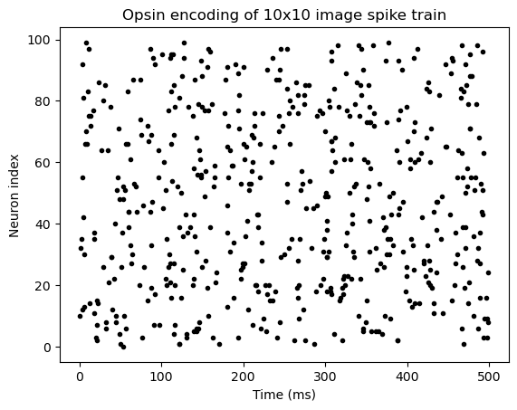
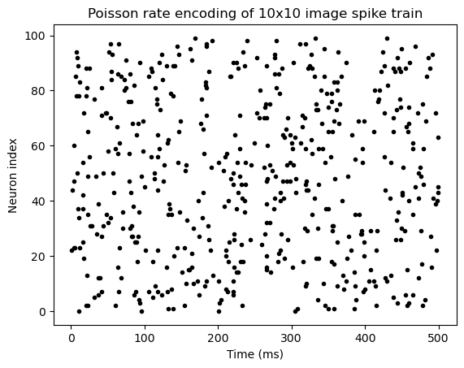

# csc2231

<!-- ## Table of Contents
- [How to encode image using opsins?](#opsin-section)
- [Using simple encoded Bayer filtered image to compare?](#bayer-encoded)
- [Which metrics to compare two spiking representations?](#images-section)
- [Metrics for spike trains](#metrics-section) -->

## Opsins for Retina-like Bayer filtering model
Opsins are proteins in the retinal photoreceptors sensitive to different wavelengths of light.

We construct a two-population neural simulation to demosaick .RAW images in the spiking domain.
Our input population uses PyRho (Evans et al., 2016) to construct a layer where each pixel is treated as a neuron.
Each neuron uses a different opsin model depending on whether the corresponding input is red (700 nm), green (546.1 nm), or blue (435.8) colours.
The output layer has Bayer-patterned connectivity to the input to interpolate the channels.

## Spike train encoding of images
Opsin based training between two populations (input, output) can be done using spike-timing dependent plasticity (STDP)

| | Opsin-based encoding | Poisson rate-coded |
|----------|----------|----------|
| Network shape | {H x W} → (Poisson rate) → (Spike-timing dependent plasticity) → {H x W x 3} | {H x W} → (Bayer filter) → {H x W x 3 demosaicked} → (Poisson rate)  |
| Method | Use retina-like network to spike encode .RAW values and use STDP to learn RGB channels | Use conventional Bayer filter and use interpolated values as Poisson rate over RGB channels
| Result |  |  |
 

## Comparing spike trains 
Each neuron within a population has a spike train, how can we compare spike trains between different neurons (in different populations)?

For individual spike train to spike train comparison, consider:

| Metric                       | Strengths                                                                       | Weaknesses                                                                               | References                          |
|------------------------------|--------------------------------------------------------------------------------|------------------------------------------------------------------------------------------|-------------------------------------|
| Victor-Purpura distance      | Compares spike timing, order, and number of spikes                            | Sensitive to spike timing precision                                                    | (Victor and Purpura, 1996)          |
| van Rossum distance          | Can detect similarities in spike time patterns with small temporal shifts     | Sensitive to differences in firing rate and spike timing precision                      | (van Rossum, 2001)                  |
| ISI-distance                 | Can detect similarities in spike patterns with different firing rates         | Sensitive to differences in ISI distribution shape and scale                            | (Kreuz et al., 2007)                |
| Spike time tiling coefficient (STTC) | Can detect precise spike timing patterns                           | Not suitable for irregular spike trains or low spike counts                              | (Cutts and Eglen, 2014)             |
| Event synchronization (ES)   | Can detect synchronous firing patterns                                        | Sensitive to differences in inter-event intervals                                        | (Quiroga and Panzeri, 2009)         |
| Modulation index (MI)        | Can quantify stimulus-driven changes in firing rate                           | Assumes baseline firing rate is stable and does not account for temporal correlations    | (Averbeck et al., 2006)             |
| Peri-Stimulus Time Histogram (PSTH) distance | Can compare firing rate profiles over time                | Sensitive to differences in spike count and temporal precision                           | (Houghton et al., 2018)             |
| Kreuz metric                 | Can detect coincident firing patterns with high precision                     | Sensitive to differences in firing rate and ISI distribution                            | (Kreuz et al., 2007)                |
